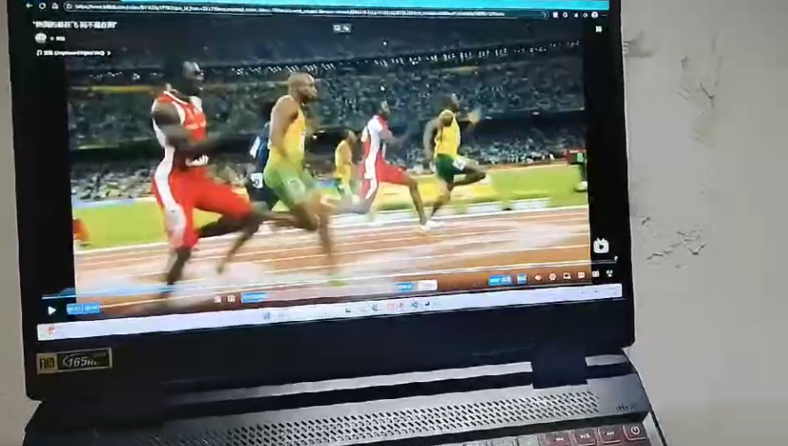
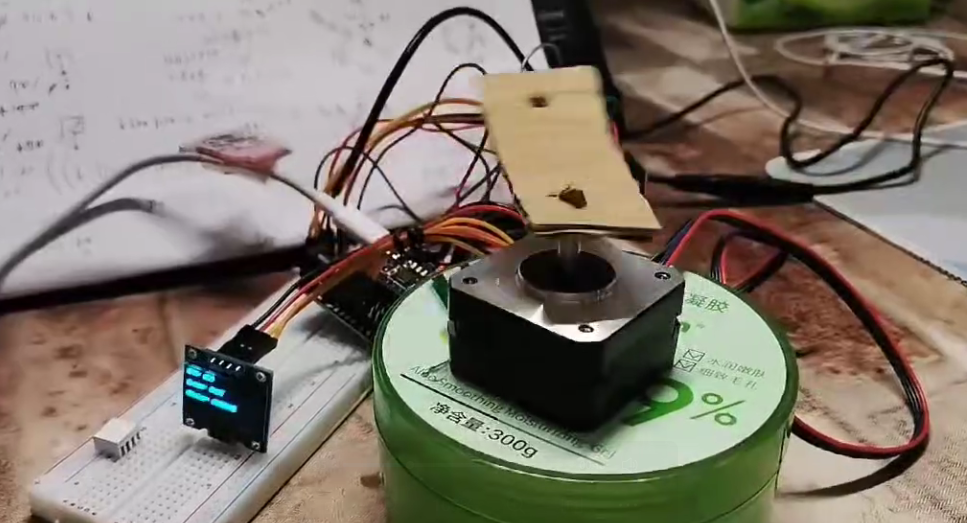

我想做一个能进行各种运动的机械臂

（模拟机器人手臂）并使用单片机结合AI视觉控制。

通过电脑上对视频画面的捕捉信息通过通信穿值到单片机控制机械臂前后运动，
也就是实现以下几点功能
# 1.wifi通信
建立TCP连接后传入电机旋转速度 2025.10.31号完成

# 2.屏幕画面检测
通过对应的算法检测画面角色运动事件激烈程度 or通过音声获取到对应的旋转权值  2.25.10.31完成初始 11.1尝试使用Yolo检测

# 3.iot控制
写好对应的程序，接收电脑控制

# 4.AI对话功能
麦克风和喇叭实现语音聊天（还没实现）

# 5.项目总结
整个系统的流水线可以总结为：
* 屏幕捕获 (mss/pyautogui) 
* 运动分析 (OpenCV/YOLO) 
* 权重映射 (0-10) 
* 速度转换(0-255) 
* TCP 通信  ESP32。

# 6.核心模块
wifi_server+screen_catch是传统A，server.py+yolopeople.py是AI版本B
## A.传统视觉处理方案
* 使用帧差法，cv2.absdiff计算帧差异。
* 去噪，使用高斯模糊，二值化与开闭运算过滤闪烁
* 量化：计算非零像素比例
* 利用双向队列deque存储帧率数据计算滑动平均值，防止电机震荡
## B.AI识别方案
* 目标检测，使用yolo11模型检测人与姿态信息
* 局部运动计算，通过计算人体边界框的宽高比变化和中心点偏移以及关键点移动来衡量运动
* 综合指标为：运动强度0.7*局部肢体运动 + 0.3*全局帧间运动

## 现实测试

